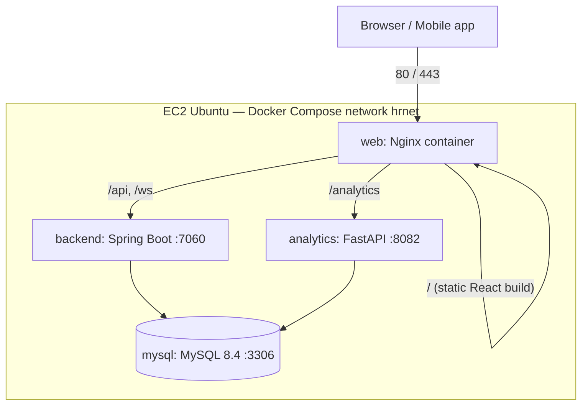

# Deploying the Pixous HR Portal to a single AWS EC2 instance

**Stack used:** GitHub → EC2 (Ubuntu) → Docker Compose → Nginx.
No Kubernetes, no ECS, no Terraform.

This guide assumes you have never done this before. Every command is copy-pasteable.

---

## Architecture

```
                        Internet
                           │
                           │  http://YOUR_IP  (later: https://your-domain.com)
                           ▼
┌─────────────────────────────────────────────────────────────────┐
│  EC2 Ubuntu instance                        Docker Compose      │
│                                                                 │
│   ┌───────────────────────────────────────────────────────┐     │
│   │  web  (Nginx)                     ports 80/443 → host │     │
│   │  • serves the built React app (static files)          │     │
│   │  • /api/*        → backend:7060                       │     │
│   │  • /ws           → backend:7060  (WebSocket)          │     │
│   │  • /analytics/*  → analytics:8082                     │     │
│   └───────┬──────────────────────────────┬────────────────┘     │
│           │                              │                      │
│           ▼                              ▼                      │
│   ┌──────────────────┐          ┌──────────────────────┐        │
│   │ backend          │          │ analytics (optional) │        │
│   │ Spring Boot      │          │ Python FastAPI       │        │
│   │ :7060 internal   │          │ :8082 internal       │        │
│   └────────┬─────────┘          └──────────┬───────────┘        │
│            │                               │                    │
│            ▼                               ▼                    │
│   ┌─────────────────────────────────────────────────┐           │
│   │ mysql  (MySQL 8.4)   :3306  INTERNAL ONLY       │           │
│   └─────────────────────────────────────────────────┘           │
│                                                                 │
│   Volumes: mysql_data · backend_storage · faces_data            │
└─────────────────────────────────────────────────────────────────┘

  Mobile app (Expo) is NOT deployed here — it runs on phones and
  calls http(s)://YOUR_IP/api like the web app does.
```



Key idea: **only Nginx is reachable from the internet.** MySQL, the backend and
the analytics service live on a private Docker network. The browser talks to a
single origin, so CORS is never an issue and `VITE_API_URL` stays empty.

---

## 0. What you need before starting

- An AWS account.
- This repo pushed to GitHub (it already has remote `https://github.com/Sbt23s/pixous-ems.git`).
- 30 minutes.

### Instance sizing

| Setup | Instance | RAM | Disk |
|---|---|---|---|
| Without analytics service | `t3.medium` | 4 GB | 20 GB |
| **With analytics service (recommended)** | **`t3.large`** | **8 GB** | **30 GB** |

The analytics image is huge (PyTorch + dlib ≈ 4–5 GB) and building dlib needs
CPU + RAM. If you must use a smaller instance, skip the analytics profile.

---

## 1. Launch the EC2 instance

1. AWS Console → EC2 → **Launch instance**.
2. Name: `hr-portal`. AMI: **Ubuntu Server 24.04 LTS (64-bit x86)**.
3. Instance type: `t3.large` (see table above).
4. Key pair: create one (e.g. `hr-portal-key`), download the `.pem` file.
5. Storage: **30 GB gp3**.
6. Security group — allow exactly these inbound rules:

   | Type | Port | Source | Why |
   |---|---|---|---|
   | SSH | 22 | *My IP* | you, only you |
   | HTTP | 80 | 0.0.0.0/0 | the app |
   | HTTPS | 443 | 0.0.0.0/0 | the app with SSL |

   **Do NOT open 3306, 7060 or 8082.** They stay inside Docker.

7. Launch, then note the **Public IPv4 address** (call it `YOUR_IP`).
   Tip: allocate an **Elastic IP** and associate it, so the IP survives reboots.

Connect:

```bash
chmod 400 hr-portal-key.pem       # on Windows: use ssh from PowerShell, skip chmod
ssh -i hr-portal-key.pem ubuntu@YOUR_IP
```

---

## 2. Install required packages

```bash
sudo apt-get update && sudo apt-get upgrade -y
sudo apt-get install -y git curl ca-certificates
```

### 2a. Add swap (important on 4–8 GB machines — the dlib build and Maven need it)

```bash
sudo fallocate -l 2G /swapfile
sudo chmod 600 /swapfile
sudo mkswap /swapfile
sudo swapon /swapfile
echo '/swapfile none swap sw 0 0' | sudo tee -a /etc/fstab
```

---

## 3. Install Docker + Docker Compose

Docker's official repository (includes the Compose v2 plugin — no separate
docker-compose install needed):

```bash
sudo install -m 0755 -d /etc/apt/keyrings
sudo curl -fsSL https://download.docker.com/linux/ubuntu/gpg -o /etc/apt/keyrings/docker.asc
sudo chmod a+r /etc/apt/keyrings/docker.asc

echo "deb [arch=$(dpkg --print-architecture) signed-by=/etc/apt/keyrings/docker.asc] \
https://download.docker.com/linux/ubuntu $(. /etc/os-release && echo "$VERSION_CODENAME") stable" | \
sudo tee /etc/apt/sources.list.d/docker.list > /dev/null

sudo apt-get update
sudo apt-get install -y docker-ce docker-ce-cli containerd.io docker-buildx-plugin docker-compose-plugin

# let the ubuntu user run docker without sudo
sudo usermod -aG docker ubuntu
newgrp docker          # or log out and back in

docker --version && docker compose version   # sanity check
```

---

## 4. Get the code

```bash
cd ~
git clone https://github.com/Sbt23s/pixous-ems.git hr-portal
cd hr-portal
```

(Private repo? Create a fine-grained GitHub **Personal Access Token** with
read-only *Contents* permission and clone with
`git clone https://<TOKEN>@github.com/Sbt23s/pixous-ems.git hr-portal`.)

---

## 5. Configure environment variables

```bash
cp .env.production.example .env
```

Generate real secrets and put them in `.env`:

```bash
openssl rand -base64 24    # → MYSQL_ROOT_PASSWORD
openssl rand -base64 24    # → DB_PASSWORD
openssl rand -base64 48    # → APP_JWT_SECRET
nano .env                  # paste the three values, set APP_CORS_ALLOWED_ORIGINS=http://YOUR_IP
```

`.env` stays on the server only. Never commit it.

---

## 6. Build and start

```bash
# everything except analytics (fast):
docker compose -f docker-compose.prod.yml up -d --build

# OR everything including the analytics/face service (first build ~20-40 min):
docker compose -f docker-compose.prod.yml --profile analytics up -d --build
```

The first backend build downloads Maven dependencies (a few minutes). Watch it:

```bash
docker compose -f docker-compose.prod.yml logs -f backend
```

You're up when you see `Started HrPortalApplication`. Flyway creates all ~66
tables and seeds demo users automatically on first boot.

### Verify

```bash
docker compose -f docker-compose.prod.yml ps          # all "healthy"/"running"
curl -s http://localhost/api/../actuator/health || true
docker exec hrportal-backend bash -c 'exec 3<>/dev/tcp/127.0.0.1/7060 && echo backend-port-open'
```

Open `http://YOUR_IP` in a browser → log in with `admin` / `Test1234@`
(**change the seeded passwords immediately in production**).

---

## 7. Day-2 operations cheat sheet

All commands run from `~/hr-portal`. Add this alias to make life easier:

```bash
echo "alias dc='docker compose -f ~/hr-portal/docker-compose.prod.yml'" >> ~/.bashrc && source ~/.bashrc
```

| Task | Command |
|---|---|
| Status | `dc ps` |
| Logs (all / one service) | `dc logs -f` / `dc logs -f backend` |
| **Restart** everything | `dc restart` |
| Restart one service | `dc restart backend` |
| Stop / start | `dc stop` / `dc start` |
| Stop and remove containers (data volumes survive) | `dc down` |
| **Update to latest code** | `git pull && dc up -d --build` |
| Update only the frontend | `git pull && dc up -d --build web` |
| Free disk from old images | `docker image prune -af` |
| Shell into a container | `docker exec -it hrportal-backend bash` |

Containers have `restart: unless-stopped`, so everything comes back
automatically after a reboot or crash.

---

## 8. Backups

### Database (the one that matters)

```bash
# manual backup
docker exec hrportal-mysql sh -c 'exec mysqldump -uroot -p"$MYSQL_ROOT_PASSWORD" --single-transaction "$MYSQL_DATABASE"' \
  | gzip > ~/backup-$(date +%F).sql.gz

# restore
gunzip < ~/backup-2026-07-20.sql.gz | \
  docker exec -i hrportal-mysql sh -c 'exec mysql -uroot -p"$MYSQL_ROOT_PASSWORD" "$MYSQL_DATABASE"'
```

Automate nightly at 02:30 (kept 14 days):

```bash
mkdir -p ~/backups
( crontab -l 2>/dev/null; echo '30 2 * * * docker exec hrportal-mysql sh -c '\''exec mysqldump -uroot -p"$MYSQL_ROOT_PASSWORD" --single-transaction "$MYSQL_DATABASE"'\'' | gzip > $HOME/backups/hr-$(date +\%F).sql.gz && find $HOME/backups -name "hr-*.sql.gz" -mtime +14 -delete' ) | crontab -
```

### Uploaded files / payslips / face encodings (named volumes)

```bash
docker run --rm -v hr-portal_backend_storage:/data -v $HOME/backups:/backup alpine \
  tar czf /backup/storage-$(date +%F).tar.gz -C /data .
docker run --rm -v hr-portal_faces_data:/data -v $HOME/backups:/backup alpine \
  tar czf /backup/faces-$(date +%F).tar.gz -C /data .
```

Ideally sync `~/backups` off the machine (e.g. `aws s3 sync ~/backups s3://your-bucket/`).

---

## 9. SSL with a domain (optional but recommended)

Prerequisite: a domain with an **A record** pointing to `YOUR_IP`.

```bash
sudo apt-get install -y certbot

# stop the web container for a minute so certbot can use port 80
docker compose -f docker-compose.prod.yml stop web
sudo certbot certonly --standalone -d your-domain.com
docker compose -f docker-compose.prod.yml start web
```

Then:

1. In `web/nginx.conf`: uncomment the 443 `server` block, set `server_name`,
   and copy the `location` blocks into it.
2. In `docker-compose.prod.yml` under `web:`: uncomment the `"443:443"` port
   and the `/etc/letsencrypt` volume mount.
3. In `.env`: `APP_CORS_ALLOWED_ORIGINS=https://your-domain.com`
4. Rebuild: `dc up -d --build web backend`

Auto-renewal (certs last 90 days):

```bash
( crontab -l 2>/dev/null; echo '0 4 1 * * docker compose -f $HOME/hr-portal/docker-compose.prod.yml stop web && certbot renew --standalone -q && docker compose -f $HOME/hr-portal/docker-compose.prod.yml start web' ) | sudo crontab -
```

---

## 10. Troubleshooting

| Symptom | Likely cause / fix |
|---|---|
| `http://YOUR_IP` times out | Security group missing port 80 rule, or `web` container down (`dc ps`) |
| Backend restarts in a loop | `dc logs backend` — usually DB creds mismatch in `.env`, or MySQL still starting (it waits via healthcheck, but a wrong password never heals) |
| `Communications link failure` | MySQL container unhealthy — `dc logs mysql` |
| Login works but no live notifications | `/ws` proxy block missing/misconfigured in nginx.conf |
| Face punch / extra analytics cards missing | Analytics profile not started, or the four hardcoded `localhost:8082` URLs in the web app not yet fixed (see REQUIRED FIX in the analysis) |
| Out of memory during build | Add swap (step 2a); build one service at a time: `dc build backend && dc build web` |
| Disk full | `docker system df` then `docker image prune -af` |

---

## Appendix: every port in this project

| Port | What | Exposed publicly? |
|---|---|---|
| 80 / 443 | Nginx (web container) | **Yes — the only ones** |
| 7060 | Spring Boot backend | No (Docker network only) |
| 8082 | Python analytics service | No (Docker network only) |
| 3306 | MySQL | No (Docker network only) |
| 6379 | Redis (optional, currently unused) | No |
| 9092 | Kafka (referenced in config, auto-config **excluded** — never needed) | No |
| 1025 | SMTP/Mailhog (dev-only, optional) | No |
| 5174 / 4173 | Vite dev server / preview (dev machines only) | No |
| 8081 / 19000 | Expo dev tools (dev machines only) | No |
